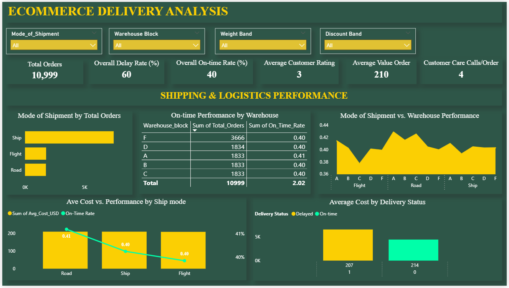
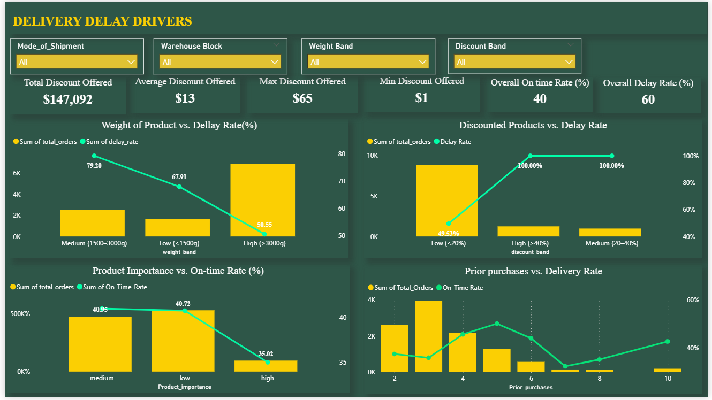
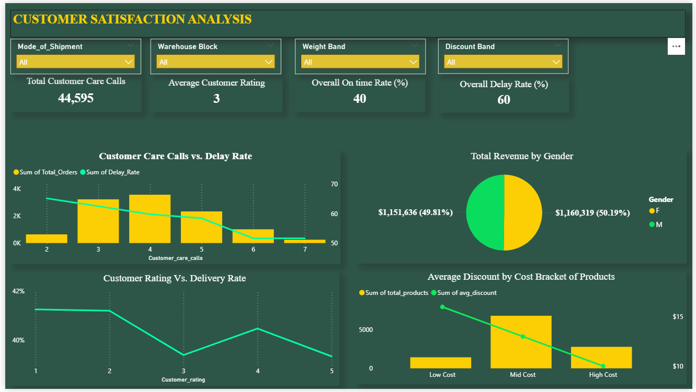

# **E-Commerce-Delivery-Analysis**

This project presents a complete end-to-end Business Intelligence workflow, analyzing an e-commerce company’s delivery performance, identifying operational inefficiencies, and uncovering drivers of customer satisfaction.

## **Table of Contents**

* [Project Overview](#project-overview)
* [Data Sources](#data-sources)
* [Tools for Analysis](#tools-for-analysis)
* [Data Cleaning, Preparation and Transformation](#data-cleaning-preparation-and-transformation)
* [Results and Findings](#results-and-findings)
  * [Shipping and Logistics Performance](#shipping-and-logistics-performance)
  * [Delivery Delay Drivers](#delivery-delay-drivers)
  * [Customer Satisfaction and Experience](#customer-satisfaction-and-experience)
* [Recommendations](#recommendations)
* [Conclusion](#conclusion)

---

## **Project Overview**

This project presents a complete Business Intelligence analysis of an e-commerce company’s delivery performance. The objective was to diagnose the root causes of high delivery delays, identify operational inefficiencies, and understand how these issues affect customer satisfaction.

Using Excel, SQL Views, Power Pivot, and Power BI, raw operational data was transformed into structured insights and actionable business recommendations.

The analysis revealed systemic challenges, only 40% of orders were delivered on time, while 60% were delayed. Additionally, over 44,000 customer care calls were recorded, signaling significant operational inefficiencies.

---

## **Data Sources**

This dataset was downloaded from Kaggle. You can learn more about it [here](https://www.kaggle.com/datasets/prachi13/customer-analytics)

The dataset used for model building contained 10999 observations of 12 variables.
The data contains the following information:

- ID: ID Number of Customers.
- Warehouse block: The Company have big Warehouse which is divided in to block such as A,B,C,D,E.
- Mode of shipment:The Company Ships the products in multiple way such as Ship, Flight and Road.
- Customer care calls: The number of calls made from enquiry for enquiry of the shipment.
- Customer rating: The company has rated from every customer. 1 is the lowest (Worst), 5 is the highest (Best).
- Cost of the product: Cost of the Product in US Dollars.
- Prior purchases: The Number of Prior Purchase.
- Product importance: The company has categorized the product in the various parameter such as low, medium, high.
- Gender: Male and Female.
- Discount offered: Discount offered on that specific product.
- Weight in gms: It is the weight in grams.
- Reached on time: It is the target variable, where 1 Indicates that the product has NOT reached on time and 0 indicates it has reached on time.

**Total Orders Analyzed:** 10,999

---

## **Tools for Analysis**

### **Microsoft Excel**

* Cleaning and profiling raw data
* Handling missing data
* Creating calculated fields (weight bands, discount categories)

### **Power Pivot (DAX)**

* Data modeling
* Creating calculated columns and delivery flags
* Segmenting products for deeper analysis

### **SQL (Views)**

Used to answer business questions, including:

* Shipment mode performance
* Warehouse efficiency
* Weight vs delivery timeliness
* Discounts vs delays
* Customer ratings
* Customer care call patterns

These SQL Views served as clean input tables for Power BI.

### **Power BI**

Designed a three-page dashboard for:

* Shipping and logistics performance
* Delivery delay drivers
* Customer satisfaction insights

---

## **Data Cleaning, Preparation and Transformation**

Activities included:

* Formatting dates and correcting data types
* Creating bins for weight, discount, and cost
* Deriving delivery time calculations
* Building a clean relational model
* Preparing SQL Views for structured analysis

This ensured a solid foundation for accurate reporting.

---

## **Results and Findings**

### **Shipping and Logistics Performance**

**Key KPIs:**

* On-Time Delivery Rate: 40%
* Delay Rate: 60%
* Total Orders: 10,999
* Average Product Cost:

  * On-time deliveries: $207
  * Delayed deliveries: $214

**Shipping Mode Distribution:**

* Ship: 7,462 orders
* Flight: 1,777 orders
* Road: 1,760 orders

All shipping modes recorded on-time performance below 42%, indicating a system-wide logistics issue.

**Warehouse Performance:**

* Warehouse A recorded the best performance at 41.35% on-time.
* Other warehouses ranged between 39–41%, showing consistently poor efficiency.

**Cost vs Delivery Status**
Higher-cost products did not experience faster delivery.

---

### **Delivery Delay Drivers**

#### **Discount Levels**

* High discount (40%+): 100% delayed
* Medium discount (20–40%): 100% delayed
* Low discount (<20%): approx. 50% delayed

Discounted products face severe fulfillment bottlenecks.

#### **Product Weight**

* Medium weight (1500–3000g): 79% delayed
* Heavy weight (>3000g): 67% delayed
* Light weight (<1500g): 50% delayed

The medium-weight segment is the biggest bottleneck.

#### **Product Importance**

* High importance: 35% on-time / 65% delayed
* Medium and Low importance: approx. 59% delayed

Priority handling is not working as intended.

---

### **Customer Satisfaction and Experience**

**Customer Ratings**

* Average Customer Rating: 3 out of 5
* Late deliveries strongly reduce ratings across customer groups.

**Customer Care Calls**

* Total Calls: 44,595
* Orders with only two customer care calls had the highest delay rate (65.2%), indicating weak issue escalation.

**Revenue by Customer Gender**

* Female Customers: $1.16M
* Male Customers: $1.15M

Revenue contribution is evenly balanced.

**Discount Patterns**

* Low-cost items receive the highest discounts.
* High-cost items receive minimal discounts.

---

## **Recommendations**

### **Strengthen Logistics Operations**

* Enforce stricter KPIs for courier partners
* Improve routing and transit-time estimates
* Activate real-time delivery issue alerts

### **Improve Warehouse Processes**

* Deploy Warehouse Management Systems
* Standardize packing and sorting workflows
* Create special lanes for heavy, discounted, or fragile products

### **Fix Discount Fulfillment Challenges**

* Pre-pack promotional items
* Forecast inventory needs better during sales events
* Create specialized handling processes for discounted SKUs

### **Overhaul Medium-Weight Handling**

* Redesign workflows for 1500–3000g items
* Improve handling equipment and material flow
* Reassess carrier loading processes

### **Enforce Priority Delivery Rules**

* Make the “high importance” flag operational
* Introduce express handling lanes for priority items

### **Improve Customer Service Workflow**

* Escalate issues after the first or second call
* Provide proactive delivery updates
* Introduce automated customer self-service portals

### **Continuous Monitoring**

* Track warehouse performance monthly
* Use SQL Views for consistent reporting
* Refresh Power BI dashboards regularly

---

## **Conclusion**

The e-commerce delivery system faces significant issues—high delays, warehouse inefficiencies, poor discount handling, and weak prioritization processes. These challenges have resulted in poor customer experience and thousands of customer support interactions. However, with the recommended operational improvements, the business can greatly enhance performance, reduce delays, improve customer satisfaction, and streamline logistics.

---
## **See the tools I use and connect with me. Reach me [here](https://github.com/Ngozi-Okonkwo)** 

